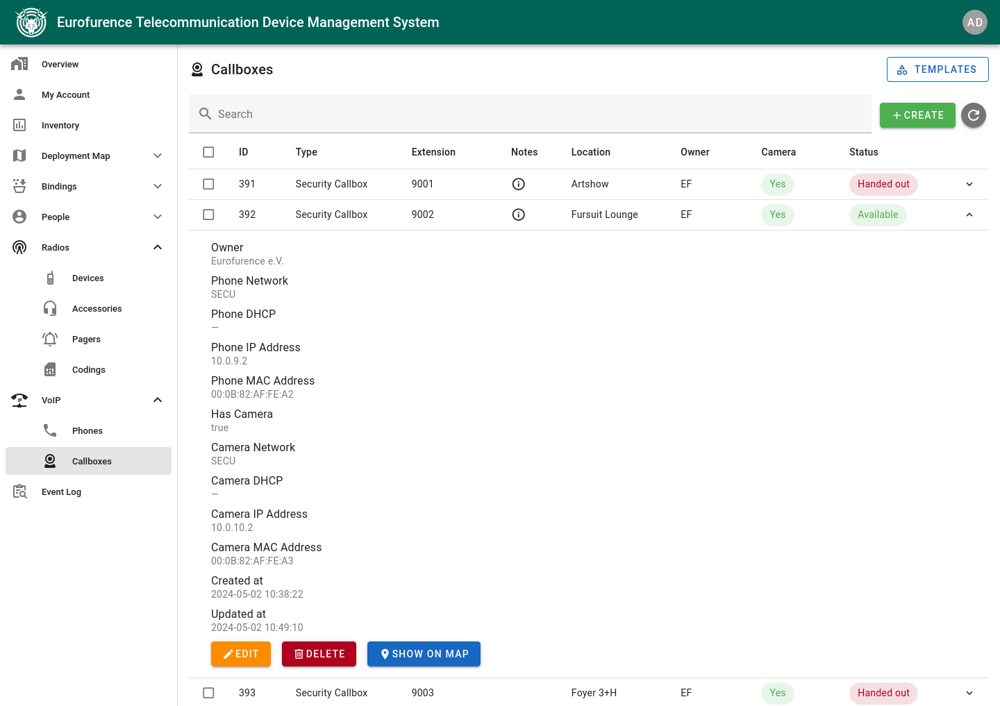

# Eurofurence Telecommunication Device Management System (EF-TDMS)

An advanced asset management system, specifically designed for managing handheld
radio devices as well as other telecommunication devices during the Eurofurence
convention.

#### Features

- Asset management of handheld radio devices, radio accessories, pagers, VoIP
  phones, and emergency phones
- Managing device handout and return processes, including pre-orders
- Handling of different item owners and private item sources
- Interactive deployment map for tracking the location of devices
- Live dashboard and inventory view
- User management with different permission groups
- Event log for tracking all events within the system, e.g., item handouts, 
  returns, creations, changes, ...
 

## Installation

1. Clone the repository
2. Copy the `.env.dist` file to `.env` and adjust the settings
3. Create empty SQLite database file
   - `touch db.sqlite3`
   - `chown 1000:1000 db.sqlite3`
4. Build with `docker compose build`
5. Run with `docker compose up -d`
6. Setup default permission groups: `docker compose exec -it backend python manage.py setuppermissions`
7. Create Django superuser with `docker compose exec -it backend python manage.py createsuperuser`

### Deploy a test installation using fixtures

1. Create a running instance of the EF-TDMS. Do not set up permissions nor create a superuser yet.
2. Load the desired fixtures into the database
   - `docker compose exec -it backend python manage.py loaddata backend/fixtures/*`
3. Set a password for the superuser
   - `docker compose exec -it backend python manage.py changepassword admin`

## Data Synchronization

The EF-TDMS can synchronize its local user database with the Eurofurence
registration system via its API. Users are identified by their EF registration
ID. New users are automatically created during synchronization. Existing users
are checked for changes and either skipped (without `--force` flag) or updated
(with `--force` flag).

To synchronize the user database execute the following steps:

1. Login to the [Eurofurence Identity Provider (IDP)](https://identity.eurofurence.org/)
2. Access the using the `My EF Registration` button within the IDP
3. Extract the JSON web token (JWT) from your Cookies
4. Start the synchronization process with the following command:
   - `docker compose exec -it backend python manage.py syncusers "https://reglive.eurofurence.org/CHANGE_ME/attsrv/api/rest/v1/" "<JWT>"`
5. Wait for the synchronization process to finish. The total number of processed
   users is displayed at the end of the process.

### Changes / Conflicts

If a user with the same registration ID exists in the local user database of the
EF-TDMS, but the user data differs from the data in the Eurofurence registration
system, a warning is displayed. If the user data should be updated, append the
`--force` flag to the synchronization command.

Example: `docker compose exec -it backend python manage.py syncusers "https://reglive.eurofurence.org/CHANGE_ME/attsrv/api/rest/v1/" "<JWT>" --force`

## Phone Provisioning

Files for zero-touch provisioning of VoIP phones can be placed in the
`provision` folder. The files are served via the `/provision` endpoint.

The endpoint is protected by HTTP basic auth. The credentials can be set in the
`docker/web/provision.htpasswd` file.

Existing provisioning files can be accessed using the web frontend. To have the
backend recognize and parse the files, the following directory structure must be
obeyed:

- `provision/cfg/` - Configuration files for the phones (e.g., `cfg000b8263d57e.xml`)
- `provision/fw/` - Firmware files for the phones (e.g., `gxp2130fw.bin`)
- `provision/phonebook/` - Phonebook files for the phones (e.g., `phonebook.xml`)
- `provision/wallpaper.jpg` - Wallpaper file for the phones

## Screenshots

This section contains various screenshots of some of the features of the EF-TDMS.

### Home Page

### Internal Overview

### Interactive Deployment Map

### Item Handout Process

### Item Return Process

### Inventory Overview

### Radio Device Management

### VoIP Phone Editing

### Callbox Management

### Zero-touch VoIP Phone Provisioning

## License

Eurofurence Telecommunication Device Management System (EF-TDMS)

Copyright (C) 2025 Niels Gandraß <niels@gandrass.de>

This program is free software: you can redistribute it and/or modify
it under the terms of the GNU General Public License as published by
the Free Software Foundation, either version 3 of the License, or
(at your option) any later version.

This program is distributed in the hope that it will be useful,
but WITHOUT ANY WARRANTY; without even the implied warranty of
MERCHANTABILITY or FITNESS FOR A PARTICULAR PURPOSE.  See the
GNU General Public License for more details.

You should have received a copy of the GNU General Public License
along with this program.  If not, see <https://www.gnu.org/licenses/>.
